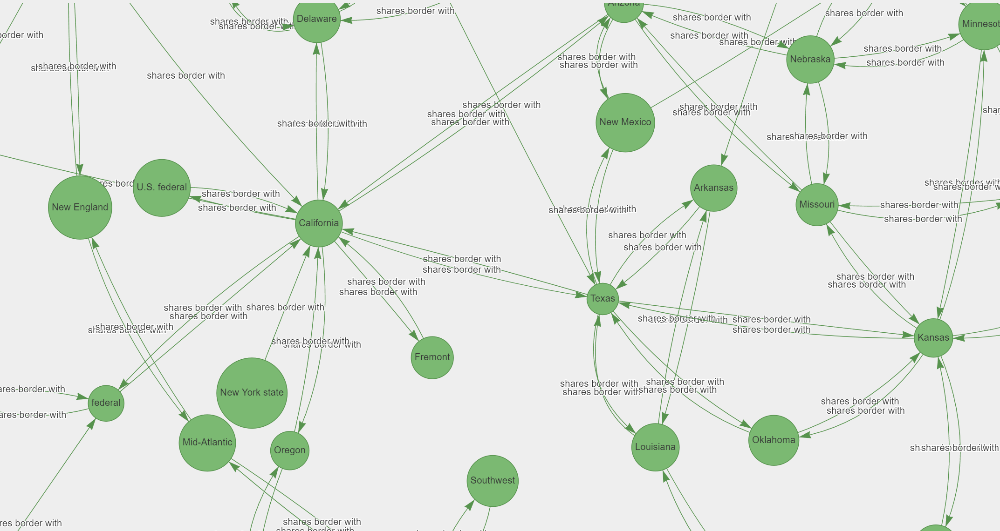
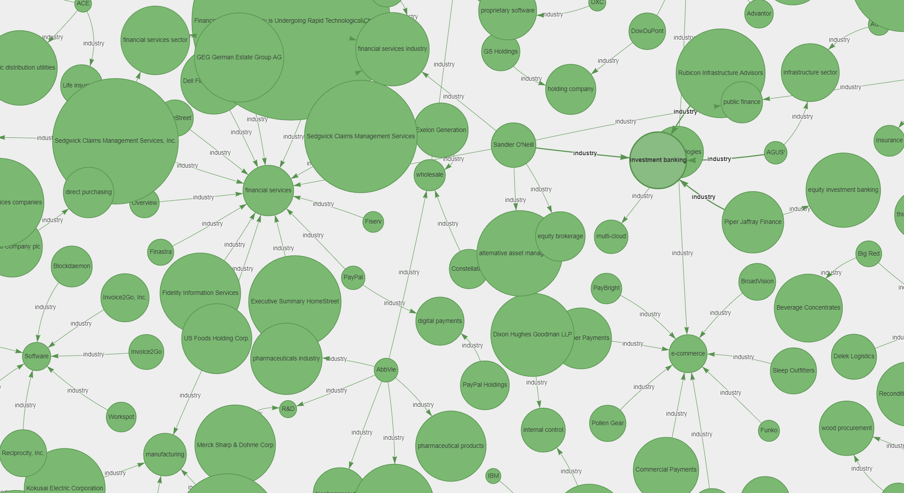
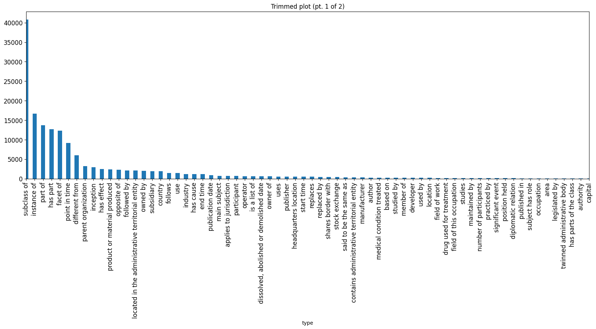
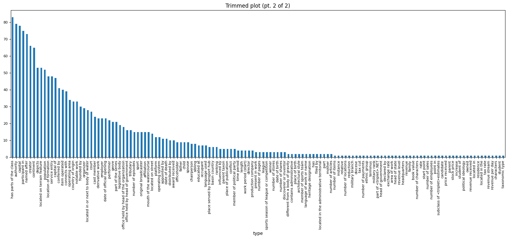

# kg-mda
Build knowledge graph from MD&amp;A of 10-Q filings from SEC EDGAR.

MD&A text data ([from here](https://github.com/chenhuililucy/Management-Discussion-and-Analysis/)) was taken to build directed knowledge graph with ~150k `head`, `tail` and `relationship_type` properties. This is shabby work, many things like node and relationship standardization and deduplication are yet to be done.

- [Notebook to generate relationships from MD&A text files.](https://www.kaggle.com/code/l0new0lf/mda-relation-extracion-2019-21/)
- [Notebook for deduplication and HTML graph visualisation.](https://www.kaggle.com/l0new0lf/mda-relation-extracion-2019-21-deduplication)
- [Graph in CSV format](https://www.kaggle.com/code/l0new0lf/mda-relation-extracion-2019-21-deduplication/output?select=mda_relations_deduped.csv)

Here are a couple of graphs for specific relationship types:

- **Shares Border With:** Graph is hosted [here](https://inf800.github.io/kg-mda/html/shares_border_with_mda2019to21.html). HTML file is available in `./html` directory.
  > *This is a **smaller** graph, so loads **faster***.
  > <a href="https://inf800.github.io/kg-mda/html/shares_border_with_mda2019to21.html"></img></a>
- **Industry:** Graph is hosted [here](https://inf800.github.io/kg-mda/html/industry_mda2019to21.html). HTML file is available in `./html` directory.
  > *This is a **larger** graph, so loads **slower***.
  > <a href="https://inf800.github.io/kg-mda/html/industry_mda2019to21.html"></img></a>

Different relationship types available (note that scales are different for the two plots):

